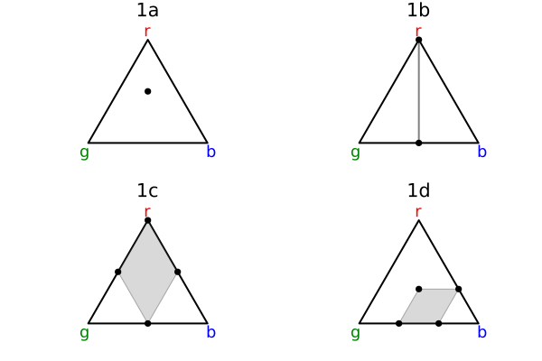

# imprecisegen

Work in progress!

Implements imprecise probabilities in Gen.jl. Currently only supports enumerative inference.

Files

- `knightian.jl` defines a new probability distribution allowing Knightian choices from distributions. An error is thrown if one attempts to sample from it.
- `imprecise-enumerative.jl` implements a modified form of enumerative inference in which samples and Knightian choices are separated.
- `lib.jl` defines functions for convenient manipulation of imprecise probabilities.
- `visualize.jl` allows for visualization of the resulting distributions as convex regions.
- `examples`
  - `cip.jl` implements the examples from [Compositional Imprecise Probability](http://arxiv.org/abs/2405.09391) by Jack Liell-Cock and Sam Staton.
  - `worldmodel.jl` has a simple Bayesian credal set update example right now, but will have a more complicated example of an agent's model
  - `predictions.jl` will be for showing how we can specify problems like P(at least two of A, B, C occur) given known probabilities P(A), P(B), P(C)
  - `twourn.jl` will be for ambiguity aversion problems from economics with maxmin utility theory

Dependencies

- `Gen.jl`, most recent committed version on GitHub for using enumerative inference (will switch to an official version once it's published)
- `IterTools`
- `Plots.jl` and `LazySets.jl` for visualization

TODO

- [ ] automatically enumerate choices in generative function rather than requiring them to be manually specified - this will simplify the code of further examples considerably
- [ ] finish the examples above
