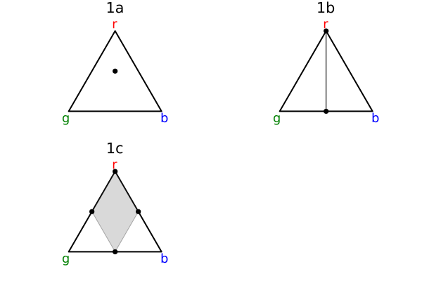

# imprecisegen

Work in progress!

Implements imprecise probabilities in Gen.jl. Currently only supports enumerative inference.

Files

- `knightian.jl` defines a new probability distribution allowing Knightian choices from distributions. An error is thrown if one attempts to sample from it.
- `imprecise-enumerative.jl` implements a modified form of enumerative inference in which samples and Knightian choices are separated.
- `lib.jl` defines functions for convenient manipulation of imprecise probabilities.
- `visualize.jl` allows for visualization of the resulting distributions as convex regions.
- `jlcss.jl` implements the examples from [Compositional Imprecise Probability](http://arxiv.org/abs/2405.09391) by Jack Liell-Cock and Sam Staton.

Dependencies

- `Gen.jl`, most recent committed version on GitHub for using enumerative inference (will switch to an official version once it's published)
- `Plots.jl` and `LazySets.jl` for visualization
